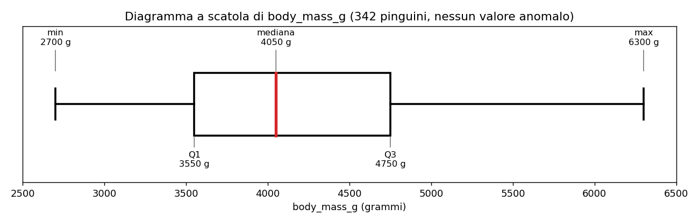

# Esercizio 5 — Scheda descrittiva di body_mass_g

## Risultati (colonna F del foglio, righe 2–345)

| Indice | Valore | Formula (Fogli Google in italiano) |
|---|---|---|
| Valori presenti | 342 | `=CONTA.NUMERI(F2:F345)` |
| Valori mancanti | 2 | `=CONTA.VUOTE(F2:F345)` |
| Minimo | 2700 | `=MIN(F2:F345)` |
| Massimo | 6300 | `=MAX(F2:F345)` |
| Media | 4201,8 | `=MEDIA(F2:F345)` |
| Mediana | 4050 | `=MEDIANA(F2:F345)` |
| Deviazione standard campionaria | 802,0 | `=DEV.ST.C(F2:F345)` |
| Q1 | 3550 | `=QUARTILE(F2:F345;1)` |
| Q2 | 4050 | `=QUARTILE(F2:F345;2)` |
| Q3 | 4750 | `=QUARTILE(F2:F345;3)` |
| Differenza interquartile (IQR) | 1200 | `=Q3-Q1` |
| Limite inferiore | 1750 | `=Q1-1,5*IQR` |
| Limite superiore | 6550 | `=Q3+1,5*IQR` |

## Diagramma a scatola

| Elemento | Valore | Posizione sull'asse |
|---|---|---|
| Baffo inferiore (minimo) | 2700 g | 1,0 cm |
| Q1 (bordo sinistro della scatola) | 3550 g | 5,25 cm |
| Mediana (linea nella scatola) | 4050 g | 7,75 cm |
| Q3 (bordo destro della scatola) | 4750 g | 11,25 cm |
| Baffo superiore (massimo) | 6300 g | 19,0 cm |

## Commento (tre righe)

1. Su 344 pinguini ho 342 pesi validi (2 mancanti). I pesi vanno da 2700 g a 6300 g e metà dei pinguini sta fra 3550 g e 4750 g.
2. La media (4202 g) è poco sopra la mediana (4050 g): la distribuzione è un po' più lunga verso i pesi alti. La deviazione standard è circa 802 g, quindi i pesi sono abbastanza sparpagliati.
3. Nessun valore è anomalo con la regola 1,5 × IQR. La dispersione è grande probabilmente perché ci sono tre specie: i Gentoo pesano in media circa 5076 g, gli Adelie circa 3701 g (tabella in `esercizio-05_Per_specie.csv`).
